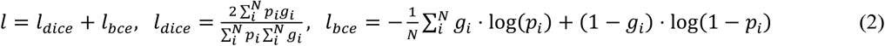

Published date: May 23, 2021
### Abstract

생물학적 세포에서 세포와 세포아세포의 시각화와 분석은 세포생물학 연구에 매우 중요하다. 그러나 기존 영상 방법에는 외인성 라벨링제를 사용해야 하므로 본래의 상태에서 살아있는 세포의 장기 평가를 방지할 수 있다. 여기서 우리는 3D U-Net 기반 아키텍처를 활용하여 레이블이 지정되지 않은 라이브 셀에서 하위 세포 기관의 3차원 분할을 제안하고 실험적으로 시연한다. 우리는 다양한 세포 유형의 세포막, 핵막, 핵 및 지질 방울의 고정밀 3차원 분할을 제시한다. 활성화된 면역 세포의 역학에 대한 시간 경과 분석은 라벨이 없는 분할을 사용하여 분석됩니다.

### Introduction

* 정량적 세포 생물학에서 살아있는 세포와 하위 세포 소기관의 형태에 대한 역학(morphological dynamics) 정량화에 대한 수요가 높음
* 최근 현미경 기술의 발전에 따라 이미지 기반의 세포 부피 정량화는 새로운 시대를 맞음
* 형광 기반 공초점 이미징(Fluorescence-based confocal imaging)은 살아있는 세포 정량화에 가장 널리 사용되는 방법으로, 세포 소기관 마커 및 관련 형광단의 높은 유연성을 제공함
* QPI(Quantitative Phase Imaging)는 섭동 (염료 염색, 형광 단백질 발현 등) 없이 살아있는 표본의 형태를 관찰하는 강력한 방법
* 최근 개발된 3차원(3D) QPI 기술은 물질의 농도에 대한 정량적 정보를 포함하는 3D 굴절률(RI) 분포를 제공하며 다양한 응용 분야에서 활용됨
* 3D QPI 이미지는 각 복셀(voxel)에 해당하는 물리적 특성을 제공할 수 있지만, 전체 세포와 세포 소기관의 정량적 역학을 동시에 모니터링하려면 보편적이고 다양한 segmentation 방법이 필
* 이를 위해서 세포 내의 특정 세포소기관을 구별하고 각 세포 단위를 이웃 세포와 구별하는 기술이 필요

3D QPI에서 이러한 셀 분할 마스크를 제공하기 위해 이전 작업에서는 임계값 기반 Otsu 분할, 최대 강도 투영에 의해 3D 이미지를 2차원(2D) 이미지로 변환, 3D 볼륨 필터링과 같은 기존 접근 방식을 널리 사용했습니다. 소기관 segmentation11-13. 그러나 이 알고리즘은 강도에 따른 소기관 특이성이 부족하고 수치 대비의 낮은 변동으로 인해 QPI 이미지의 소기관 분할에 거의 적용되지 않을 수 있습니다. RI는 특정 물질의 농도에 의해 독점적으로 결정되는 고유 값이므로 RI 범위는 세포 내 다른 구획 간에 쉽게 겹칠 수 있습니다.

최근 몇 년 동안 3D QPI 영상에서 이러한 문제를 극복하기 위해 세포 및 세포 소기관 형태에 기반한 기계 학습 기술이 채택되었습니다. 특히, 핵분할14, 정자분절15, 지질방울분할16 등 특정 기능보다는 많은 양의 데이터를 기반으로 하는 딥러닝 접근 방식이 활용되고 있습니다. 이러한 의미론적 분할 방법은 개별 세포 단위를 구별하는 방법이 없기 때문에 세포 분석을 위해 단일 세포 이미지를 사용해야 합니다. 세포 연구에서 의미론적 분할의 이러한 한계를 극복하기 위해 여러 연구에서 면역 세포의 면역학적 시냅스를 추적하거나 정자 세포를 분석하기 위해 세포별 분할을 제안했습니다. 그러나 이러한 방법은 주로 특정 세포 유형 또는 세포 소기관의 분할에 초점을 맞추기 때문에 몇 가지 분석에서 그 적용 가능성이 제한됩니다. 다양한 응용 분야에서 사용하려면 수많은 세포 유형 중에서 개별 세포와 세포 소기관을 정확하게 분할하는 강력한 모델을 개발해야 합니다.

이 연구는 라벨이 없는 살아있는 세포의 정량 분석을 위한 보편적인 프레임워크를 제시합니다. 이 연구는 크게 세 가지 기여를 합니다. 첫째, 전체 세포와 소기관의 정량적 역학을 동시에 모니터링하기 위해 3D QPI 이미지에서 딥 러닝 및 세포 특성을 사용한 자동 분할 프레임워크를 제안했습니다. 제안된 자동 분할 프레임워크는 한 세포 내에서 여러 소기관을 분할하는 "다중 소기관 분할" 모델과 개별 세포를 인접 세포와 구별하는 "세포별 분할" 모델로 구성됩니다. 둘째, 우리는 이 모델이 생물학자들에게 인기 있는 수많은 부착 및 현탁액 세포주 중에서 시공간적 견고성을 가지고 있음을 확인했습니다. 제안된 프레임워크는 특정 소기관을 대상으로 하는 것이 아니라 여러 소기관을 동시에 고려하여 세포 내 소기관의 관계를 학습하였다. 이처럼 학습에 사용되지 않는 다양한 셀 내에서도 안정적인 성능을 보였다. 특히 cell-by-cell segmentation 모델은 세포막과 핵 정보를 기반으로 특정 세포에 국한되지 않고 다양한 세포주에서 작동합니다. 마지막으로, 우리는 RI, 단백질 밀도 및 제안된 segmentation 모델 간의 선형 상관 관계를 이용하여 형태학적 및 생화학적 특성을 활용하는 RAW 264.7 세포의 정량 분석을 보여줍니다. 결과는 제안된 방법이 자동 세포 연구를 위한 새로운 분석 접근 방식을 제공함을 시사합니다.

### Results

1. 딥러닝 기반 다중 소기관 및 세포별 segmentation 모델
제안된 살아있는 세포 분석 과정은 크게 두 가지 과정으로 구성되었다. 먼저 개별 세포와 세포 소기관에 대한 분할 마스크를 생성했습니다. 그런 다음 생성된 각 분할 마스크와 해당 RI 값을 사용하여 형태 및 물리적 특성(예: 부피, 표면적 및 농도)을 얻었습니다.

이를 위해 데이터 기반 딥 러닝 기술을 활용했습니다. 특히, 우리는 그림 1과 같이 다중 소기관 segmentation 모델을 위한 것과 세포별 segmentation 모델을 위한 두 가지 서로 다른 3D 컨볼루션 신경망을 사용했습니다. 다중 소기관 segmentation 모델은 다음의 segmentation 마스크를 예측합니다. 입력 3D RI 단층 촬영에서 4개의 소기관(그림 1a); 핵, 핵소체, 원형질막 및 지질 방울(그림 1b). 우리는 세포 분석에 일반적으로 사용되는 이 4가지 소기관을 선택했습니다. 다양한 작업을 동시에 학습함으로써 모델은 개별 소기관의 특성과 서로 간의 관계를 학습합니다. 이 다중 작업 학습은 각 작업을 개별적으로 훈련하는 것에 비해 과적합18을 방지하고 계산 시간을 크게 줄입니다.

*다중 소기관 segmentation 및 세포별 segmentation 모델의 개요.  
(a) 입력 3D 단층 촬영에서 다중 소기관 segmentation 모델은 막, 핵, 핵소체 및 지질 방울과 같은 4개의 세포내 소기관의 segmentation 마스크를 예측합니다. (b) 세포별 분할 모델은 예측된 막 및 핵 마스크를 활용하여 인스턴스 마스크를 예측합니다. (c) 예측된 분할 마스크의 예.*

세포별 분할 모델은 전체 세포의 멤브레인 마스크를 각 세포의 마스크로 나눕니다. 이 모델은 다중 소기관 segmentation 모델 결과에서 얻은 핵 및 막 마스크를 사용합니다(그림 1c). 각 세포에 적어도 하나의 핵이 있다고 가정하면 핵 마스크를 종자로 사용하여 개별 세포를 분리했습니다. 멤브레인 마스크를 사용하여 비세포 영역과 세포 영역을 구분했습니다. 모델에 대한 자세한 내용은 온라인 방법 섹션에 설명되어 있습니다.

위에서 설명한 segmentation 모델을 훈련하고 평가하기 위해 살아있는 NIH3T3 세포의 129개의 3D QPI 이미지를 측정했습니다. 수집된 3D QPI 이미지의 실제 마스크를 생성하기 위해 3명의 전문 생물학자가 Insight Segmentation and Registration Toolkit(ITK)-Snap19라는 오픈 소스 소프트웨어를 사용하여 개별 세포와 4개의 세포 소기관의 마스크에 수동으로 주석을 달았습니다. 그 후 수집된 데이터를 105개의 훈련 데이터 세트와 24개의 평가 데이터 세트로 분할했습니다. 또한 모델 일반화 가능성을 확인하기 위해 훈련에 사용되지 않은 4개의 다른 세포주(A549, MDA-MB-231, HeLa 및 RAW 264.7)를 사용하여 각 세포주를 다른 기관에서 추출했습니다. A549는 인간 폐 암종 세포주, MDA-MB-231은 인간 유방 선암종 세포주, HeLa는 인간 자궁 경부 선암종 세포주, RAW 264.7은 마우스 대식세포 세포주입니다. 각 세포주에 대해 9개의 3D QPI 이미지가 캡처되었습니다. 이러한 세포주는 다른 기관의 특성을 대표하고 생물학적 실험실에서 널리 사용되는 세포주이기 때문에 사용되었습니다. 세포주의 준비 및 QPI 데이터 생성 프로세스는 온라인 방법 섹션에 자세히 설명되어 있습니다.

Dice 점수는 모델의 segmentation 성능을 정량적으로 측정하는 데 사용되었습니다. 이것은 이미지 분할에서 가장 자주 사용되는 메트릭으로, 정답과 예측 마스크 사이의 유사성을 정량화합니다(식 3). 5개 세포에 대한 세포 인스턴스 분할의 평균 Dice 점수는 0.758인 반면 멤브레인 분할의 평균 Dice 점수는 0.831이었습니다. NIH3T3 및 RAW 264.7 세포의 경우 멤브레인 분할의 Dice 점수와 세포별 분할의 Dice 점수 차이는 미미했습니다. 그러나 나머지 세포의 경우 세포별 분할의 Dice 점수가 막 분할의 Dice 점수보다 약간 낮았습니다. 이러한 세포주는 융합 성장을 특징으로 하기 때문에 결과적인 세포별 분할 작업은 매우 어려웠습니다. 마찬가지로, NIH3T3 및 Raw 264.7 세포에 대한 핵 분할의 Dice 점수는 나머지 세포보다 높았습니다. 핵소체 분할에 대한 주사위 점수의 변동은 비교적 작았습니다. 이것은 핵소체의 RI가 세포간에 유사하기 때문입니다. 지질 방울의 부피가 다른 세포 소기관에 비해 상대적으로 작았기 때문에 지질 방울 segmentation의 주사위 점수는 다른 세포 소기관보다 훨씬 낮았습니다. 마스크의 전체 볼륨이 작은 경우 위양성 및 위음성 예측의 작은 부분이 Dice 점수를 크게 줄일 수 있습니다.

다음으로 전문가를 활용하여 정성적 평가를 수행했습니다(그림 2). 세포별 분할 모델은 훈련에 사용되지 않은 A549, MDA-MB-231, HeLa 및 RAW 264.7 세포주에서 잘 수행되었습니다. 5개의 세포주 각각은 세포 소기관에서 서로 다른 모양 특성을 가졌다. NIH3T3는 작은 겉보기 핵, 적은 수의 핵소체, 길고 겹치는 막 구조를 가지고 있습니다. A549 세포는 하나 또는 두 개의 큰 핵소체를 소유하고 큰 지질 방울이 있는 얇은 막을 가지고 있지만 분명한 트림 핵을 가지고 있었습니다. HeLa 세포는 큰 눈에 띄는 핵막과 핵에 적은 수의 핵소체를 가지고 있으며 A549 세포보다 두꺼운 막을 가지고 있습니다. MDA-MB-231 세포를 소유했지만, 하나 또는 두 개의 큰 핵소체를 가지고 있습니다. RAW 264.7 세포의 형태는 4개의 다른 세포주의 형태와 완전히 달랐습니다. RAW 264.7 세포의 크기는 다른 5개 세포주의 크기보다 작았습니다. 게다가, RAW 264.7 세포는 뾰족한 원형 막을 가지고 있었습니다. 핵의 크기는 대부분의 세포를 구성할 만큼 충분히 컸다. 우리는 이 모델을 다른 특성을 가진 세포주에 적용했고 다양한 세포주에서 매우 잘 작동하는 것을 관찰했습니다. 또한, 3D 세포 분할에 의해 생성된 마스크는 세포 및 세포 소기관의 더 나은 형태학적 특징을 보여주었습니다(그림 3).

*해당 예측 및 실측 마스크가 있는 Dice 점수의 정량적 결과 및 예.  
(a) 숫자는 예측과 실제 마스크 사이의 주사위 점수를 나타냅니다. 예측 마스크와 실측 마스크의 2D 슬라이스가 중첩됩니다. (b) 예측과 진실의 3D 마스크. (c) NIH3T3, RAW 264.7, HeLa, MDA-MB-231 및 A549 세포에 대한 정량적 결과.*

*NIH3T3, A549, MDA-MB-231, HeLa 및 RAW 264.7 세포에 대한 정성적 결과의 예.  
(a) 3D 입력 단층 촬영. (b) 셀 인스턴스의 분할 마스크. (c) 멤브레인의 분할 마스크. (d) 핵과 핵소체의 분할 마스크. (e) 지질 방울의 분할 마스크. (f) 4개의 세포내 소기관의 병합된 분할 마스크. (g) 입력의 확대된 패치.*

2. segmentation된 마스크를 사용한 정량적 세포 분석
살아있는 세포를 분석하기 위해 부피, 표면적 및 농도를 활용했습니다. 볼륨은 분할 마스크의 총 복셀 수와 3D QPI 이미지의 볼륨을 곱하여 계산되었습니다. 표면적을 계산하기 위해 3D 분할 마스크에서 삼각형 메쉬를 구성했습니다. 농도는 식 (1)에 따라 계산되었습니다.
포함된 이미지
여기서 N은 분할 마스크 세트의 인덱스입니다. ni는 복셀의 RI입니다. n0은 주변 미디어의 RI(1.3337)입니다. RII는 지질 방울에 대해 0.135로, 나머지 세포 소기관에 대해 0.19로 설정된 상수입니다.

대식세포는 타고난 면역 체계에서 필수적인 역할을 하는 백혈구입니다. 대식세포 식균작용 박테리아, 전염증성 및 항균성 매개체 분비20. 대식세포는 전사 인자 활성화 단백질 1(AP-1) 및 c-Jun N-말단 키나제(JNK)와 같은 전염증 조절자를 암호화하는 유전자의 전사를 유도합니다. 이것은 대식세포 활성화21로 알려진 환경 자극에 대한 노출을 통해 달성됩니다. 활성화된 대식세포는 표현형을 변경하는 것으로 알려져 있지만 세부 사항은 잘 정의되어 있지 않습니다. 활성화된 대식세포는 노출 자극에 따라 M1과 M2의 두 가지 표현형이 있습니다. 대식세포 분극화는 면역계에서 다른 행동을 유발하고 세포 모양을 다르게 변경합니다22. 세포의 모양과 대식세포의 기능 사이의 중요한 관계가 연구되었지만, 전체 세포와 세포 소기관의 모양 변화에 대한 정량적 분석에 대한 연구는 거의 없습니다. 우리는 대식세포 활성화가 유전자 및 단백질 발현, 세포 및 세포내 소기관의 형태 및 물리적 특성에 영향을 미칠 것이라고 가정했습니다. 이를 위해 마우스 대식세포주인 RAW 264.7을 모델로 사용하였고, 세균성 지질다당류(LPS) 처리를 통해 대식세포 활성화를 유도하였다.

2차 분석 없이 3D QPI는 활성화된 RAW 264.7 세포의 형태 및 생화학적 변화를 직접 관찰하고 계산할 수 있었습니다. LPS 처리된 RAW 264.7 세포의 3D RI 단층 사진은 활성화된 세포가 24시간 이내에 극적인 형태학적 변화를 겪는 것으로 나타났습니다(보충 그림 2). 대조군 RAW 264.7 세포는 배양 접시 바닥에 약간 부착된 전형적인 대식세포 세포의 원형을 특징으로 합니다. 그러나 LPS 처리 8시간 후, 이러한 RAW 264.7 세포는 부피가 팽창하기 시작하여 접시 바닥에 부착되었습니다. 24시간에 부착된 세포는 세포질에서 라멜리포디아와 과립을 형성했습니다(보충 그림 2). 이러한 RAW 264.7 세포가 LPS 처리에 대한 초기 반응 동안 모양을 동적으로 변경함에 따라 활성화 프로세스 동안 8.5시간 동안 RAW 264.7 세포의 변화하는 매개변수를 추적하고 계산하려고 시도했습니다.

LPS 처리된 RAW 264.7 및 처리되지 않은 대조군 세포의 3D RI 단층 사진을 무표지 상태의 3D QPI 현미경에서 최대 8.5시간 동안 30분마다 획득했습니다. 3D 세포 분할은 모든 시간 경과 이미지로 수행되어 세포 소기관 마스크를 생성했습니다(그림 4a). 생성된 마스크는 활성화 대식세포 프로세스의 표현형을 나타냅니다. 멤브레인 마스크는 시간이 지남에 따라 활성화된 대식세포의 확산 형태를 3D로 완벽하게 표현했습니다. 그림 4a는 활성화된 대식세포의 확인된 부피가 멤브레인 마스크를 통해 더 커지고 넓어졌음을 보여줍니다. xy 슬라이스 외에도 yz 및 xz 슬라이스를 사용하면 생성된 마스크를 통해 증가된 세포막 부피를 쉽게 식별할 수 있습니다. 핵과 핵소체 및 지질 방울의 세포 소기관 마스크는 라벨이 없는 홀로그램 이미지에서 획득했습니다. 핵의 크기가 세포막을 따라 커지는 것처럼 보이지만, 막과 핵에 비해 핵소체에서 머무름 경향이 관찰되었습니다. 가장 눈에 띄는 변화는 지질 방울에서 관찰되었습니다. 염증 중에 대식세포가 세균성 LPS와 같은 염증 자극을 인식하면 자신의 몸에 콜레스테롤 에스테르와 트리글리세리드의 축적을 유도합니다23. 이 모델은 지질 방울을 정확하게 분리할 수 있었으며 이는 이전 연구에서 볼 수 있듯이 지방 및 지질 방울의 크기가 증가함을 나타냅니다. 0분에는 지질 방울의 수와 크기가 작았지만 LPS 노출 8.5시간 후 지질 방울의 크기와 수는 증가했습니다. 그림 4b는 LPS 유도 활성화 과정 동안 RAW 264.7 세포에 대한 RI 값의 평균 변화를 나타냅니다. 우리는 RI 값에서 개별 마스크의 단백질 농도, 표면적 및 부피를 측정하여 이러한 매개변수를 시간 경과에 따라 추적했습니다. 그림 4a 및 보충 그림 2에서 관찰된 세포 확산과 일치하게, RAW 264.7 세포의 부피와 표면적은 8시간 활성화 후 크게 증가했습니다. RAW 264.7 세포막의 평균 RI는 LPS 처리 직후 감소하기 시작하여 8.5시간 경과 측정 후에 꾸준히 감소했습니다. 막의 단백질 농도는 감소했지만 막의 표면적과 부피는 8.5시간 동안 점진적으로 증가했습니다(그림 4a). 막과 유사한 핵은 RI와 단백질 농도를 감소시키는 경향이 있습니다. 핵의 부피와 표면적이 증가하는 반면, 핵의 부피와 면적은 초기에 약간 증가하여 8.5시간 동안 유지됨을 확인하였다. 다른 세포내 소기관(예: 핵 및 핵소체)에 비해 RI가 매우 높은 지질 방울의 경우 활성화 과정에서 RI가 8.5시간 동안 유지되는 것으로 관찰되었습니다.

*RAW 264.7 셀의 타임랩스 이미지에 적용  
(a) 초과 근무(0, 2, 4, 8시간)에 따른 RAW 264.7 세포의 수평 평면 및 관상 평면 보기. 각 패널은 막, 핵, 핵소체 및 지질 방울의 RI 단층 촬영 및 분할 마스크를 나타냅니다. (b) 검은색 선과 밝은 음영은 LPS 처리되지 않은 RAW 264.7 셀(n=9)의 대조군을 나타내는 반면, 빨간색 선과 어두운 음영은 LPS 처리된 RAW 264.7 세포(n=12)를 활성화하는 것을 보여줍니다. 평균 RI 및 평균 단백질 농도는 활성화에 의해 감소한 반면, 평균 표면적 및 평균 부피는 활성화 동안 증가했습니다. (c) RAW 264.7 세포에서 최소에서 최대까지를 나타내고 세포내 소기관의 평균 부피의 모든 지점을 나타내는 상자 플롯.*

막과 핵과 유사하게 대조군 세포와 비교하여 대식세포 활성화 동안 지질 방울의 표면적과 부피가 증가했습니다. 이러한 관찰은 대식세포에서 LPS로 유도된 변화가 표현형으로 발생하고 물리적 변화로 나타난다는 것을 시사합니다. 우리는 시간 경과 데이터의 시작점에서 끝점까지 세포내 소기관의 개별 마스크를 비교했습니다(그림 4c). 부피와 표면적이 증가했지만 각 소기관의 평균 RI는 8.5시간 동안 급격히 감소했습니다. 결과는 RAW 264.7 세포가 활성화 과정에서 농도를 잃으면서 크기가 증가했음을 나타냅니다. 이것은 전체 세포와 핵, 핵소체 및 지질 방울을 포함한 세포 소기관에서 발생했습니다.

### Discussion and Conclusion

결과는 3D QPI와 심층 신경망 기반 segmentation 모델을 결합한 제안된 프레임워크가 레이블이 없는 3D 라이브 셀 분석을 자동화된 방식으로 가능하게 함을 보여줍니다. 제안된 프레임워크는 개별 세포 내 소기관의 segmentation 마스크를 예측하고 RI를 사용하여 세포 및 소기관에 대한 물리적 및 형태학적 정보를 제공합니다. 특히, 각 세포를 자동으로 분할하기 위해 각 세포에 적어도 하나의 핵이 있다고 가정했습니다. 세포의 예측된 핵분할 마스크를 시드 정보로 사용하여 각 세포를 구별했습니다. 제안된 프레임워크는 특정 소기관을 대상으로 하지 않았습니다. 오히려 여러 장기를 동시에 예측했습니다. 여러 세포소기관을 동시에 분할하도록 모델을 훈련함으로써, 모델은 세포기관의 관계를 학습하고 훈련에 사용되지 않은 다양한 세포주에서도 안정적인 성능을 보였다. 또한 타임랩스 데이터에서 세포 역학을 자동으로 추적하고 관찰함으로써 기존의 생물학적 지식이 제안된 프레임워크를 통해 확인될 수 있음을 입증했습니다.

우리가 아는 한, 이 작업은 다양한 3D 세포 소기관을 인스턴스 수준에서 동시에 자동으로 분석하는 유형의 첫 번째 작업입니다. 즉각적인 미래 연구 우선 순위는 모델 성능을 더욱 개선하는 데 있습니다. 더 강력한 모델을 위해서는 베이지안 신경망23과 불확실성 예측24, 25을 사용한 안정적인 학습 방법론을 도입하는 것이 고려되어야 합니다. 향후 연구에서는 이 프레임워크를 확장하여 사용자 상호 작용을 활용하여 예측된 segmentation 마스크를 개선해야 합니다. 세포 계통 추적 기술과 결합하면 세포의 시간적 분화 과정의 변화를 자동으로 모니터링할 수 있습니다. 또한 대용량 3D 영상을 처리하는 네트워크의 효율성을 높여 실시간 분석을 지원할 수 있다.

---

## Online Methods

### Deep-Learning Models
*세포 소기관 segmentation*  

다중 소기관 segmentation 모델은 3D RI 단층 촬영 이미지를 입력으로 사용하고 핵, 핵소체, 막 및 지질 방울의 4개 소기관의 이진 마스크를 예측합니다(보충 그림 1). 우리는 각 소기관에 대해 독립적인 모델을 훈련하는 것과는 대조적으로 4개의 다른 세포 기관의 마스크를 동시에 예측하도록 모델을 훈련합니다. 다중 작업 학습으로 알려진 이 접근 방식은 여러 작업의 전반적인 성능을 향상시킵니다18. 또한 단일 모델만 사용하여 모델 학습 시간을 획기적으로 단축했습니다.

3D RI 단층 촬영 이미지는 100×600×600에서 260×860×860 복셀까지 다양한 고해상도를 가지고 있습니다. 따라서 전체 볼륨을 사용하여 세포 소기관 segmentation 모델을 훈련하려면 거대한 GPU(그래픽 처리 장치) 메모리가 필요합니다. 이러한 이유로 훈련 단계에서 처음에 입력 3D RI 단층 사진의 크기를 128×512×512 복셀로 조정했습니다. 그런 다음 크기가 조정된 3D RI 단층 사진에서 64×128×128의 패치를 무작위로 샘플링하고 이를 입력으로 활용했습니다. 모델은 입력 패치에 대해 동일한 해상도를 생성하는 각 세포 소기관에 대한 확률 맵을 예측했습니다.

추론 단계에서 입력의 크기를 128×512×512 복셀로 조정하고 64 크기 대칭 패딩을 적용했습니다. 64 크기의 z축을 따라 중앙에서 입력 이미지를 자릅니다. 그런 다음 보폭이 128인 64×128×128 패치를 균일하게 생성하고 각 패치에 대한 확률 맵을 얻었습니다. 스플라인 커널을 사용하여 패치를 스티칭하여 예측된 패치를 이미지의 전체 볼륨으로 재구성했습니다. 그런 다음 스티칭된 확률 맵에서 패딩 영역을 제거하고 원래 해상도로 복원했습니다. 마지막으로 임계값 0.5를 사용하여 확률 맵을 이진화하여 분할 마스크를 얻었습니다.

*Cell-by-cell segmentation*  
세포의 인스턴스 마스크를 예측하기 위해 세포별 분할 모델은 세포 소기관 분할 모델에 의해 예측된 핵 및 막의 분할 마스크를 사용합니다. 핵 마스크는 세포 수와 대략적인 위치에 대한 사전 정보로 사용되었습니다. 멤브레인 마스크는 모델이 배경 영역을 셀로 예측하는 것을 방지했습니다. 모델은 처음에 예측된 핵 마스크를 핵의 인스턴스 마스크 ni ∈ RD×H×W로 분리했습니다. 여기서 i ∈ {1,…, k}는 핵의 인덱스를 나타냅니다. k는 총 핵 수입니다. 세포의 핵이 분리됨에 따라 핵의 인스턴스 마스크는 연결 성분 알고리즘을 사용하여 간단하게 얻어졌습니다. 그런 다음 i번째 핵 인스턴스 마스크 ni를 선택하고 이를 포지티브 맵 posi로 간주했습니다. 나머지 핵 인스턴스는 네거티브 맵으로 간주되었습니다. 멤브레인 마스크 m, posi 및 negl을 I에 연결하여 선택한 핵 인스턴스(ni)를 포함하는 셀의 인스턴스 확률 맵(xi)을 예측했습니다.

학습 단계에서 하나의 핵 인스턴스를 무작위로 선택하고 선택한 셀의 인스턴스 마스크를 예측하도록 모델을 학습했습니다. 추론 단계에서 모델은 각 핵에 대해 이 과정을 반복하고 가장 높은 확률을 갖는 핵의 인덱스를 할당하여 인스턴스 마스크를 최종적으로 얻었습니다. M = argmaxi=1,… Nxi, 여기서 N은 핵의 수입니다. 가장 높은 확률이 0.5 임계값보다 낮은 경우 복셀을 배경으로 간주했습니다.

세포 소기관 segmentation 작업과 달리 패치 전략은 인스턴스 마스크를 예측할 때 전체 세포 모양이 중요하기 때문에 셀별 segmentation 작업에 적용할 수 없었습니다. 따라서 x 및 y축에서 입력을 128×128로 축소하고 z축을 따라 크기가 조정된 입력을 64 크기로 자릅니다. 그런 다음 예측된 인스턴스 마스크를 입력의 원래 크기로 복원했습니다.

*네트워크 아키텍처 및 교육 세부정보*  
3D U-Net 기반 아키텍처가 채택되었으며26, 이는 이러한 모델에 따라 생물의학 이미지 분할 작업에서 인상적인 성능을 보이는 것으로 입증되었습니다. 특히, 우리는 3D 세포 이미지 분할에 최적화된 아키텍처를 자동으로 설계하는 ScNas(Scalable Neural architecture search)27를 사용했습니다. ScNas는 확률적 샘플링 알고리즘을 활용하여 네트워크 매개변수와 마이크로 레벨 아키텍처를 식별합니다. U-Net과 유사하게 구성된 네트워크는 인코더 및 디코더 셀로 구성되었습니다. 인코더 셀은 해상도를 점차적으로 축소하여 여러 스케일에서 특징 맵을 추출하는 반면 디코더 셀은 추출된 특징 맵을 원래 해상도로 업샘플링하고 복셀의 레이블을 분류합니다. 각 셀은 3D 컨볼루션 레이어, ReLU(Rectified Linear Unit), 풀링 작업 및 정규화 레이어의 반복 스택으로 구성됩니다. 우리는 세포 소기관 및 세포별 분할을 위해 구성된 네트워크를 활용했습니다.

ScNas의 활성화 및 정규화 기능을 각각 Leaky-ReLU28 및 인스턴스 정규화29로 선택했습니다. 초기 특징 맵의 크기, 레이어 수 및 특징 맵 승수는 각각 12, 8, 3으로 설정되었습니다. 네트워크의 하이퍼 매개변수는 그리드 검색 알고리즘을 사용하여 조정되었습니다. 모델은 8 V100-32G GPU 머신에서 PyTroch 1.4 프레임워크를 사용하여 Python 3.7에서 구현되었습니다.

무작위 뒤집기, 자르기 및 회전과 같은 여러 데이터 보강 전략이 적용되었습니다. 특히, 3D RI 단층 촬영의 다양한 해상도를 처리하기 위해 입력 이미지의 크기를 0.5에서 2로 조정했습니다. 우리는 학습률이 0.001인 Adam30 옵티마이저를 활용했으며 30에 대한 유효성 검사 메트릭이 개선되지 않으면 학습률을 5배로 줄였습니다. 모델을 훈련하기 위해 Dice 손실과 이진 교차 엔트로피( 기원전) 손실; 이것은 다음과 같이 정의됩니다.

여기서 N은 복셀의 수입니다. pi와 gi는 각각 i번째 복셀의 예측 확률과 정답 레이블을 나타냅니다. 다중 소기관 세분화 작업의 경우 모델이 여러 작업을 동시에 수행하도록 훈련했습니다. 따라서 각 세포내 소기관에 대한 손실을 계산하고 모든 손실의 합계를 결정했습니다. 셀별 분할의 경우 선택한 인스턴스 마스크와 해당 예측 간의 손실을 간단히 계산했습니다.

*Metrics*  
정량적 평가를 위해 예측된 마스크와 해당하는 실제 마스크 간의 유사성을 측정하는 주사위 계수를 채택했습니다. 이 계수는 다음과 같이 정의됩니다.

여기서 G는 실측 마스크입니다. P는 예측된 마스크입니다. 셀별 분할 작업의 경우 주사위 계수 점수, 주사위(Pi, Gj). 예측 및 진실과 관련된 모든 인스턴스 마스크 쌍에 대해 결정되었습니다. 그런 다음 헝가리 알고리즘31을 적용하여 Dice 점수가 가장 높은 Gj(ground-truth)에 예측(Pi)을 할당했습니다.

*세포주 및 세포 배양*  
NIH3T3, A549, HeLa 및 RAW 264.7 세포주는 한국 세포주 은행(KCLB, Seoul, Korea)에서 구입하여 10%( vol/vol) 태아 소 혈청(FBS; Hyclone, SH30084) 및 1% 항생제-항진균 용액(Thermo Fisher Scientific). MDA-MB-231 세포는 한국 세포주 은행(KCLB, Seoul, Korea)에서 구입하여 10%(vol/vol) FBS(Hyclone, SH30084) 및 항생제 항진균제 용액(Thermo Fisher Scientific).

*RAW 264.7 셀의 LPS 처리 및 TomoDish 도금*  
정확히는, Escherichia coli의 LPS(100μg/mL 스톡, List Biological Laboratories) 30μL를 10% FBS 및 1% 항생제-항진균제가 보충된 Dulbecco의 Modified Eagle 배지 3mL에 첨가했습니다. 마우스 대식세포 세포주인 3.0 x 105 RAW 264.7 세포를 계수하여 15 mL 튜브에 첨가하고 세포를 100 x g에서 5분 동안 원심분리하여 세포 펠렛을 수집하였다. 상청액을 흡인하여 제거하고, 세포 펠렛을 LPS 함유 배지 3mL에 부드럽게 재현탁시켰다. 그런 다음 RAW 264.7 세포가 포함된 3mL의 배지를 TomoDish(Tomocube, Inc.)로 옮겼습니다.

*3D QPI*  
세포의 3D RI 이미지는 DMD(Digital Micromirror Device)가 장착된 Mach-Zehnder 간섭계를 기반으로 하는 상용 홀로토모그래피(HT-2H, Tomocube Inc., Korea)를 사용하여 얻었다. 간섭성 단색 레이저(= 532 nm)를 2×2 단일 모드 광섬유 커플러를 사용하여 기준 빔과 샘플 빔의 두 경로로 분할했습니다. 3D RI 단층 촬영은 49개의 조명 조건, 수직 입사 및 극각(64.5°)을 갖는 48개의 방위각 대칭 방향에서 획득한 여러 2D 홀로그램 이미지에서 재구성되었습니다. DMD는 샘플 32에 충돌하는 조명 빔의 각도를 제어하는 ​​데 사용되었습니다. 샘플에서 회절된 빔은 높은 개구수(NA) 대물 렌즈(NA=1.2, UPLSAP 60XW, Olympus)를 사용하여 수집되었습니다. 제한된 NA로 인한 누락된 원뿔 문제를 보완하기 위해 비음성 기반의 정규화 알고리즘이 사용되었습니다33. 상보성 금속 산화물 반도체 이미지 센서(FL3-U3-13Y3MC, FLIR Systems)를 사용하여 축외 홀로그램을 기록했습니다. 상용 소프트웨어(TomoStudio™, Tomocube Inc.)를 사용하여 3D RI 맵과 빨간색 유사 색상을 사용한 해당 3D 형광 신호의 시각화를 수행했습니다. 원리 및 재구성 알고리즘에 대한 자세한 내용은 다른 곳에서 찾을 수 있습니다34, 35.

*홀로토모그래피 현미경을 이용한 타임랩스 영상*  
3D QPI 이미징 전에 HT-2H(Tomocube, Inc.)를 켜서 최소 30분 동안 레이저를 예열했습니다. 또한, TomoChamber(Tomocube, Inc.)에서 37°C의 온도와 5% CO2 대기를 유지하기 위해 이산화탄소(CO2) 가스 혼합기와 온도 조절기를 켜십시오. TomoChamber(Tomocube, Inc.)의 물 저장소는 이미징 동안 습도를 유지하기 위해 고압증기멸균된 증류수로 채워졌습니다.

LPS 처리 직후, TomoDish가 포함된 RAW 264.7 셀을 TomoChamber에 장착한 다음 이 챔버를 HT-2H 스테이지에 부드럽게 장착했습니다. 그런 다음 HT-2H를 보정하고 획득 탭을 사용하여 시간 경과 이미징 설정을 시작했습니다. RAW 264.7 셀 타임랩스 이미징의 경우 3D QPI 이미지는 17카운트 동안 30분마다 15개의 다른 위치에서 촬영되었습니다. 이것은 3D QPI 타임랩스 이미지를 획득하기 위해 8.5시간 만에 완료되었습니다.
<!-- This page was last updated at {{ "now" | date: "%Y-%m-%d %H:%M" }}. -->
<!-- updated: {{ page.last-modified-date | date: '%B %d, %Y' }} -->