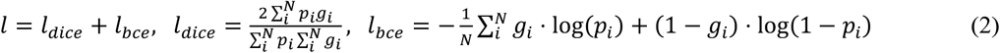
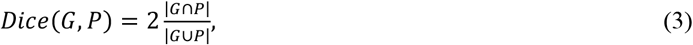

Published date: December 7, 2021
### Abstract

여러 시공간 규모에 걸쳐 손상되지 않은 생물학적 시스템의 다양한 측면을 동시에 이미징하는 것은 생물학 및 의학의 오랜 목표이며, 기존 이미징 방식의 한계로 인해 진행이 방해받고 있습니다. 여기에서 우리는 그러한 측정을 위한 수단으로 빛-물질 상호작용을 지배하는 고유량인 굴절률(RI)을 사용할 것을 제안합니다. 우리는 외인성 형광 라벨링을 통해 일반적으로 액세스되는 주요 내인성 세포내 구조가 3차원(3D) RI 단층 사진으로 인코딩되어 있음을 보여줍니다. 우리는 해당 세포 내 표적의 RI 측정에서 여러 3D 형광 단층 촬영을 유추하는 딥 러닝 기반 모델을 사용하여 데이터 기반 방식으로 이 정보를 디코딩하여 다중 미세 단층 촬영을 달성합니다. 형광에 대한 굴절률에 대해 RI2FL이라고 하는 이 접근 방식은 고특이성 형광 이미징과 무표지 RI 이미징의 장점을 모두 계승합니다. 중요하게도, 절대 및 편향되지 않은 RI의 전체 3D 모델링은 일반화를 향상시켜 즉각적인 적용을 용이하게 하기 위해 재교육 없이 접근 방식을 광범위한 새 샘플에 적용할 수 있습니다. 이 기술의 성능, 신뢰성 및 확장성은 광범위하게 특성화되어 있으며 전례 없는 규모(실험적으로 테스트 가능한 새로운 가설을 생성할 수 있음)에서 단일 셀 프로파일링 내 다양한 ​​응용 프로그램을 시연합니다.

### Main

이미징은 대비라고 하는 변수를 공간과 시간에 매핑하는 프로세스입니다. 서로 다른 대비 메커니즘 간의 균형은 기본적으로 각 이미징 방식1의 고유한 특성을 결정합니다. 생물 의학에서 형광(FL)은 생물학적 시스템 내의 특정 요소를 시각화하기 위해 수십 년 동안 표준 광학 이미징 대조로 사용되었으며 화학적, 면역학적 및 유전적 라벨링 전략에 의해 구동됩니다. 그러나 우수한 생화학적 특이성에도 불구하고 FL과 관련된 많은 단점이 있습니다. 여기에는 광표백 및 광독성(시간적 창을 제한함), 스펙트럼 중첩(다중화를 제한함), 라벨링 품질의 가변성(재현성 및 잠재적 편향을 제한함) 및 외인성 라벨링으로 인한 부작용(내인성 생물학의 교란으로 이어질 수 있음)이 포함됩니다. .

머신 러닝의 최근 발전은 교차 양식 추론 또는 인 실리코 라벨링으로 알려진 흥미로운 접근 방식을 촉발했습니다. 이 기술은 보완적인 특성3,4,5,6,7,8,9,10으로 또 다른 대비를 측정하여 FL 대비를 달성합니다. 특히, 동시 FL 및 명시야(BF, 흡수 대비 기반) 또는 차동 간섭 대비(DIC, 위상 대비 기반) 현미경의 이미지 쌍을 사용하여 신경망이 BF 또는 DIC 이미지를 FL 이미지로 변환하도록 훈련했습니다. 4(각각 BF2FL 및 DIC2FL이라고 함). 이러한 초기 작업의 독창성에도 불구하고 레이블이 지정되지 않은 샘플의 컴퓨터 염색을 가능하게 하는 것은 종종 3D 세포내 구조에 대해서도 놀라운 성능을 나타냈지만 이러한 기존 방식의 고유한 단점(즉, BF의 세포 수준에서 최소 흡수 및 제한된 정량적 위상 정보 DIC1,11에서) 교차 양식 추론을 위한 더 나은 대조 메커니즘에 대한 중요한 지속적인 탐구를 촉발했습니다(보충 표 1).

유망한 접근 방식은 측정된 대비7,8,9,10로 정량적 광학 위상 지연을 활용합니다. 새로운 QPI(양적 위상 이미징) 기술은 레이블이 지정되지 않은 샘플의 위상 이미지를 고감도11로 측정하며, 이는 교차 양식 추론을 위해 FL 이미지와 짝을 이룰 수 있습니다. 새로운 대비 메커니즘인 2차원(2D) QPI는 셀룰러 수준에서 이전 제품에 비해 향상된 성능을 보여주었습니다9. 그러나 2D 위상 이미징을 기반으로 하는 이 클래스의 방법은 RI와 샘플 두께의 결합에 의해 근본적으로 제한되어 픽셀 단위 위상 값이 형태에 따라 달라집니다. 현재까지 이 접근 방식은 간단한 육안 검사로 식별할 수 있는 전체 구조(예: nuclei9 및 neurites10)의 추론을 입증했지만 사소한 세포내 구조는 아닙니다. 또한 훈련된 추론 모델은 새로운 샘플로 일반화하는 데 적합하지 않았으며 모든 단일 애플리케이션에 대해 모델을 처음부터 다시 훈련해야 했습니다9.

이 연구에서 우리는 다양한 시공간 규모에 걸쳐 내인성 세포내 구조 및 역학의 레이블 없는 다중화 미세 단층 촬영을 위한 데이터 기반 기술을 보고합니다. 우리는 흡수와 위상 지연을 모두 포함하는 빛-물질 상호 작용을 지배하는 내인성 양인 3D RI의 대비 메커니즘을 도입하여 교차 모드 추론 프레임워크를 근본적으로 개선합니다. 고속 다중 각도 홀로그래피(또는 홀로토모그래피)라고 하는 3D QPI 기술로 측정한 회절 제한 3D RI 단층 촬영은 해당 세포 내 표적(RI2FL이라고 함)에 대한 여러 3D FL 단층 촬영의 확장 가능한 추론을 가능하게 합니다. 중요하게도, 우리는 절대적이고 편향되지 않은 RI(샘플 형태에서 분리됨)와 전체 3D 모델링을 통해 RI2FL이 세포 유형 전반에 걸쳐 일반화할 수 있고 따라서 재훈련 없이 광범위한 새로운 샘플에 쉽게 적용할 수 있음을 보여줍니다. 우리는 RI2FL의 성능과 확장성을 광범위하게 특성화하고 실제 적용을 위한 시공간 불확실성 정량화 및 단일 셀 프로파일링을 위한 동반 도구를 통합합니다. 우리는 이 광범위하게 적용 가능한 파이프라인이 이전에 볼 수 없고 실험적으로 테스트 가능한 가설을 생성하기 위해 전례 없는 규모로 살아있는 세포의 높은 처리량 단일 세포 프로파일링을 가능하게 함을 보여줍니다.

### Results

**RI-FL 관계의 데이터 기반 발견**  
우리는 RI 단층 촬영을 여러 세포 내 표적에 해당하는 FL 단층 촬영으로 변환하기 위해 3D 컨볼루션 신경망을 훈련함으로써 데이터 기반 방식으로 RI 분포를 세포 내 표적에 연결하는 양적 관계를 결정하려고 했습니다(그림 1a). 우리는 먼저 6개의 세포내 표적(액틴, 미토콘드리아, 지질 방울, 원형질막, 핵 및 핵소체)과 6개의 진핵 세포에서 ~1,600개의 3D RI 단층 촬영 사진(532 nm 파장)과 해당 3D FL 단층 촬영으로 구성된 대규모 데이터 세트를 만들었습니다. 세포 유형(NIH3T3, COS-7, HEK 293, HeLa, MDA-MB-231 및 성상세포)은 모두 FL 채널이 장착된 표준화된 홀로토모그래피 현미경을 사용하여 살아있는 세포에 있습니다12(방법). 네트워크를 훈련시키기 위해 NIH3T3 단층 사진의 하위 집합만 사용하고 다른 모든 데이터는 유지하여 세포 유형에서 발견된 RI-표적 관계의 일반화를 테스트했습니다(보충 표 2).

*그림 1: 여러 세포내 구조의 데이터 기반 현미경 단층 촬영.  
a, RI2FL 개념의 개략도. b, 세포 유형 및 세포내 표적 전반에 걸친 RI2FL의 예. 모든 경계 상자는 76.8 × 76.8 × 12.8 µm3의 부피를 나타냅니다.*

RI와 FL의 고유한 특성은 몇 가지 실험 및 계산 문제를 나타냅니다. 첫째, RI는 실험자 또는 기기와 무관한 절대적이고 편향되지 않은 양이지만 FL 신호는 라벨링 품질, 조명 전력 및 노출 시간1,2에 크게 의존합니다. 이 문제를 해결하기 위해 우리는 데이터 수집 및 처리 파이프라인 전반에 걸쳐 훈련된 세포 생물학자가 수행하는 엄격한 품질 관리 절차를 구현하여 3D FL(방법)에 의해 정의된 실제 세포 내 표적을 설정했습니다. 둘째, FL 채널 간의 급격한 차이로 인해 개별 대상별 네트워크 아키텍처를 힘들게 최적화해야 합니다. 대신 우리는 대규모 신경 아키텍처 검색으로 구동되는 모든 서브셀룰러 대상에 대해 매우 유연한 단일 네트워크 아키텍처를 활용했으며, 이는 추가 서브셀룰러 대상으로의 확장에도 잠재적으로 유리했습니다. (확장 데이터 그림 1a). 셋째, 고해상도 3D RI 단층 촬영은 대부분의 그래픽 처리 장치에서 실행 불가능한 막대한 메모리 요구 사항을 가지고 있습니다. 이 제한을 피하기 위해 대상별 패턴이 RI의 로컬(~10 μm) 분포에서 식별될 수 있다고 가정하고 패치 기반 병렬 처리를 구현했습니다(확장 데이터 그림 1b). 이러한 전략을 사용하여 RI2FL 추론을 위한 네트워크를 성공적으로 훈련했습니다(그림 1b 및 보충 비디오 1).

**성능, 일반화 및 RI 고유의 이점**  
보류된 데이터 세트에서 추론된 FL과 실제 FL을 정량적으로 비교하여 RI2FL의 성능을 특성화했습니다. 세포 유형에 따른 예측 정확도는 그림 2a에 나와 있습니다. 놀랍게도 NIH3T3 세포뿐만 아니라 훈련 중에 네트워크에 제공되지 않은 다른 모든 세포 유형도 높은 성능을 보였습니다. 특히, 다른 불멸화 세포주와 달리 1차 배양에서 얻은 성상교세포에 대한 탁월한 정확도는 RI2FL이 세포 유형 전반에 걸쳐 일반화할 수 있는 기본적인 RI 표적 관계를 포착했음을 강력하게 뒷받침했습니다. 타겟별 성능은 그림 2b에 나와 있습니다. 핵 및 지질 방울에 대한 높은 정확도는 이러한 표적의 높은 RI 대비와 일치하지만 RI 단층 촬영의 육안 검사를 통해 인식하기 어려운 나머지 모든 표적은 비슷한 성능을 보였습니다(보충 표 3 참조 추가 성능 메트릭). 다음으로 우리는 추론 및 실제 FL 데이터(확장 데이터 그림 2)에서 개별 세포 내 구조를 감지하고 비교하여 대부분의 실제 이미징 연구에서 중요한 돌출 국부 구조를 감지하는 RI2FL의 성능을 테스트했습니다. 우리는 실제 구조의 ~90%가 평균 중심간 거리가 0.32 µm인 추론된 구조와 일치할 수 있으며 일치된 구조 내의 강도 값이 강한 양의 상관 관계를 가지고 있음을 확인했습니다(Pearson의 상관 계수, r = 0.77 ). 또한 데이터 세트의 라벨링으로 인한 편향을 배제하기 위해(형광단15의 낮은 밀도로 인해 가능성이 낮음), 염색되지 않은 샘플로 RI2FL을 수행한 다음 동일한 샘플을 염색하여 해당 FL 기준 사실을 얻었습니다. 이 실험은 일관된 결과를 보여주었다(Extended Data Fig. 3). 또한 RI 재구성 오류에 대한 FL 추론 성능의 민감도를 특성화했습니다(확장 데이터 그림 4). 함께, 우리의 결과는 RI2FL에 의한 내인성 세포하 표적의 원활한 식별을 확인했습니다.

*그림 2: 기존 접근 방식과 비교한 성능 특성화.  
a–c, 세포 유형(a)에 대한 일반화의 RI2FL 성능 정량화(구조적 유사성 지수(SSIM)로 계산됨) , HEK 293, HeLa, MDA-MB-231 및 성상교세포), 세포내 표적(b)(N = 11, 10, 7, 10, 5 및 5 NIH3T3 테스트 세트 단층촬영 액틴, 미토콘드리아, 지질 방울, 원형질막, 핵 및 핵소체) 및 방법(c)(N = 48개의 세 가지 방법 모두에 대한 동일한 NIH3T3 테스트 세트 단층 촬영). 모든 정량화는 보류된 데이터에 대해 수행되었습니다. 데이터 세트 분할 세부 정보 및 추가 통계는 각각 보충 표 2 및 3에 나와 있습니다. 평균  ± .d.; *P = 5.4 × 10−5, \*\*P = 1.1 × 10−13, \*\*\*P = 6.6 × 10−19(짝이 없는 양측 t-검정). d, FL 추론에서 BF, DIC 및 RI의 성능을 비교하는 예. 경계 상자는 동일한 FOV에 해당하는 76.8 × 62.1 × 12.8 μm3 부피를 나타냅니다. 수치 소스 데이터는 소스 데이터에 제공됩니다.*

다음으로 BF 및 DIC3,4에 비해 RI의 이점을 정량화했습니다. RI는 흡수 및 위상 지연 정보를 모두 포함하는 완전한 광학 정보를 나타내기 때문에 푸리에 광학 1,11(보충 참고 1)을 사용하여 RI 단층 촬영에서 누적 BF 및 DIC 이미지를 재구성할 수 있지만 그 반대는 불가능합니다. 시뮬레이션된 스택과 해당 FL 단층 촬영으로 BF2FL 및 DIC 네트워크를 훈련하고 BF2FL, DIC2FL 및 RI2FL의 성능을 비교했습니다(그림 2c, d). RI2FL과 다른 방법 사이에는 상당한 차이가 있었습니다. 적층된 BF 또는 DIC 이미지의 광학 정보는 전체 RI 정보의 하위 집합일 뿐이기 때문에 이는 놀라운 일이 아닙니다. 3D에서 우리의 관찰은 BF, 기존 위상 및 정량 위상 이미지의 직접 측정을 기반으로 하는 2D의 이전 결과와 일치합니다.

**불확실성 정량화를 통한 신뢰성 평가** 
RI2FL이 이전의 교차 모드 추론 접근 방식과 함께 제공하는 흥미로운 기회에도 불구하고 공간과 시간에서 모델 예측을 '신뢰'할 수 있는 정도는 불분명합니다. 최근 관련 분야18,19에 도입된 베이지안 딥 러닝16,17의 발전을 교차 모달 추론에 적용하여 이를 설명하고자 했습니다. 이를 위해 FL 예측과 함께 '오차 막대'로 최종 사용자를 안내하기 위해 불확실성 맵을 정량화했습니다. 직관적으로 불확실성은 데이터 또는 모델의 섭동에 대한 예측의 복셀 단위 가변성으로 추정할 수 있습니다(확장 데이터 그림 5a, b; 앞서 언급한 연구18,19, 재구성 손실 함수를 설계할 때 더 많은 유연성을 위해). RI2FL의 불확실성 정량화를 보여주는 예가 그림 3a에 나와 있습니다(확장 데이터 그림 5c, d 및 보충 비디오 2 참조). 동물 세포 분열 동안 핵막이 분해되어 방추 장치에 의해 정렬된 염색체의 분리가 용이해집니다. 훈련 데이터 세트에서 드물게 발생하는 이 특정 이벤트는 RI2FL에 의한 핵 예측을 특히 핵 주변에서 어렵게 만듭니다. 이 단계에서 불확실성의 특정 증가(그림 3a, 빨간색 화살표)는 다운스트림 분석에 대한 경고 신호를 던집니다. 핵이 있는 이 특정 예는 다른 2D 응용 프로그램19에서도 관찰되었지만(따라서 생물학적이지만 불확실성의 응용 프로그램별 기원은 확인하지 않음), 불확실성 정량화는 최종 사용자에게 전체론적 외에도 다양한 상황에서 시공간적 신뢰성 측정을 제공할 수 있습니다. 정확도 메트릭. 불확실성 지도는 또한 모델20을 강화하기 위한 데이터 수집을 안내할 수 있습니다.

*그림 3: 공간과 시간의 불확실성 정량화 및 확장성.  
a, 불확실성 정량화 예. 위: 시간 경과 RI 단층 촬영으로 관찰된 세포 분열의 역학. 흰색 화살표는 분할 세포와 딸 세포를 나타냅니다. 하단: 해당 핵 추론 및 데이터 불확실성 맵. 빨간색 화살표는 이 세포 상태에 고유한 핵막의 추정 파괴로 인한 더 큰 불확실성을 강조 표시합니다. 경계 상자는 49.2 × 49.2 × 12.8 µm3의 부피를 나타냅니다. b, RI-표적 관계의 이동 불변성을 이용하여 RI2FL을 대형 FOV 단층 촬영으로 확장합니다. 더 큰 경계 상자는 480 × 480 × 13 µm3의 부피를 나타냅니다. c, 공간과 시간에서 RI2FL을 확장하여 RI-대상 관계의 시간 불변성을 더욱 활용합니다. 경계 상자는 307 × 307 × 13 µm3의 부피를 나타냅니다. b 및 c에서는 시각적 명확성을 위해 4개의 FL(액틴, 미토콘드리아, 핵 및 지질 방울) 채널만 표시됩니다.*

**여러 시공간 척도에 걸쳐 확장 가능한 추론**  
RI2FL은 RI-대상 관계가 시프트 및 시간 불변이기 때문에 본질적으로 공간과 시간에서 확장 가능합니다. 패치 기반 처리(Extended Data 그림 1b)와 함께 훈련된 모델은 이미지 스티칭 또는 높은 공간 대역폭 제품 기술21,22에 의해 얻은 큰 시야(FOV) RI 단층 촬영에 쉽게 적용할 수 있습니다. 우리는 높은 공간 분해능을 절충하지 않고 최대 480 × 480 × 13 μm3의 큰 FOV를 가진 단층 촬영에 대해 RI2FL을 성공적으로 작동했습니다(그림 3b). 또한 RI2FL은 최대 72 h의 기록에서 시연한 것처럼 시간 경과 대형 FOV 단층 촬영에 순차적으로 적용할 수 있습니다(그림 3c 및 보충 비디오 3). 중요하게도, 광표백 및 광독성이 없기 때문에 홀로토모그래피의 공간적 및 시간적 규모에는 이론적인 상한선이 없습니다(그림 4의 실험 예 참조). 유일한 실질적인 제한은 데이터 차원에 따라 선형적으로 확장되는 계산 시간과 메모리입니다.

*그림 4: 시간 경과에 따른 광표백 없는 이미징.  
시간 경과 3D RI 및 FL(지질 방울) 이미징은 매우 느린 부피 속도(3 분당 1 부피)에서도 시간이 지남에 따라 FL 광표백(빨간색 화살표)을 명확하게 보여줍니다. 대조적으로, RI 및 추론된 FL 데이터는 시간 경과에 따른 신호 저하를 나타내지 않습니다. 모든 이미지는 3D 단층 촬영의 최대 강도 투영을 나타냅니다.*

**규모에 따라 손상되지 않은 살아있는 세포의 단일 세포 프로파일링**  
RI2FL의 흥미로운 적용은 세포 생물학 및 고처리량 스크리닝에 사용하기 위한 시간 분해 하이브리드 단일 세포 프로파일링입니다. 표준화된 데이터 수집 및 해석 가능한 특징 추출을 통한 단일 세포의 이미지 기반 프로파일링은 새로운 표현형 및 세포 이질성에 대한 통찰력을 제공하여 유전체학을 보완합니다(예: CellProfiler23). 이 기능은 고도로 다중화된 FL 이미징에 크게 의존하지만 스펙트럼 겹침 문제는 다중 라운드 이미징을 통해 고정된 세포로 이러한 측정을 제한합니다. 한편, 온전한 살아있는 세포에서 RI2FL을 사용한 다중 미세 단층 촬영은 단일 세포 표현형의 시간 분해 프로파일링을 가능하게 합니다. 또한 RI는 FL에 직교하는 추가 정보를 제공합니다. 전통적으로, RI는 세포 주기 및 성장 연구와 특히 관련이 있는 세포하 질량의 초고감도 정량화에 고유하게 적합한 양식이었습니다25,26. RI의 이러한 양적 특성은 단일 세포 프로파일링을 위한 새로운 차원에 접근하기 위해 FL의 특이성과 상승적으로 결합될 수 있습니다(그림 5a 및 방법). 이전 접근 방식6(2D 반사 기반 교차 양식 추론 기반)과 달리 당사의 파이프라인은 FL 및 정량적 질량 모두에 대한 전체 3D 정보에 대한 액세스를 제공하므로 비할 데 없는 세부 정보를 마이닝하여 새로운 실험을 안내합니다.

*그림 5: 전례 없는 규모의 단일 셀 프로파일링에 적용  
a, RI2FL을 기반으로 하는 완전 자동화된 단일 셀 프로파일링 파이프라인의 개략도. 경계 상자는 76.8 × 76.8 × 12.8 µm3의 부피를 나타냅니다. b, 추출된 65개의 단일 셀 기능(N = 4,033개 셀)을 기반으로 하는 단일 셀의 UMAP(Uniform manifold approximation and projection) 감독되지 않은 임베딩. c, 단일 셀에 매핑된 세 가지 대표적인 기능의 시각화. d–g, 성장 인자(d,e) 및 화학유전학적 자극(f,g)을 사용한 교란 실험. d,f, 타임랩스 RI2FL 이미지. RI 및 3개의 FL(액틴, 핵 및 원형질막) 채널이 표시됩니다. 경계 상자는 76.8 × 55.4 × 12.8 μm3(d) 및 76.8 × 76.8 × 12.8 μm3(f)의 부피를 나타냅니다. 예: 시간 경과에 따른 d(e) 및 f(g)에 대한 해당 기능 역학. 시각적 명확성을 위해 65개 기능 중 3개만 표시됩니다. d의 흰색 화살표는 라멜리포디아 형성을 나타냅니다. 수치 소스 데이터는 소스 데이터에 제공됩니다.*

온전성 검사를 위해 먼저 6가지 세포 유형으로 데이터 세트에서 감지된 ~4,000개의 단일 세포를 프로파일링했습니다. 우리의 완전 자동화된 파이프라인은 개별 세포를 강력하게 분할하고 형태, FL, RI 또는 ​​이들의 조합으로 정의된 다양한 해석 가능한 기능을 추출했습니다(보충 표 4). 우리는 단일 셀의 대표 패싯에 걸쳐 있는 65개 기능의 최소 중복 세트를 정의하고 실제 FL(모든 기능 및 FL 채널에서 r = 0.97, 확장 데이터 그림 6)을 사용하여 RI2FL 추론 기능 값을 정량적으로 검증했습니다. 현재 수준의 다중화23로 수천 개의 단일 셀 기능을 쉽게 정의할 수 있습니다. 65개의 단일 세포 기능의 감독되지 않은 저차원 임베딩은 세포 유형 전반에 걸쳐 그리고 세포 유형 내에서 흥미로운 가변성을 드러냈습니다(그림 5b). 이 가변성의 기초가 되는 3개의 예시적인 특징이 도 5c에 도시되어 있다. 성상교세포는 일반적으로 복잡한 항성 형태와 일치하는 큰 세포 부피를 가지고 있습니다. 특징적인 액틴 구조를 갖는 섬유아세포인 NIH3T3 세포는 높은 액틴 밀도를 나타냈다. HEK 293 세포는 높은 질량 밀도를 가졌는데, 이는 이 세포 유형에 의한 높은 단백질 생산 비율 때문일 수 있습니다. 특히, 이 세 가지 기능과 다른 모든 기능에 대해 각 세포 유형 내에서 엄청난 변동성이 관찰되었으며, 이는 부분적으로 세포 주기에 의존하여 단일 세포 프로파일링을 매력적으로 만듭니다.

**단일 세포의 시간 분해 고차원 프로파일링**  
다음으로 시한부 심문을 진행했습니다. 개념 증명을 위해 일련의 섭동 실험을 수행했습니다. 먼저 NIH3T3 섬유아세포를 PDGF(혈소판유래성장인자)로 자극하여 생리학적인 방식으로 세포 성장을 촉진시켰다. 이것은 광표백과 광독성이 없는 고속 홀로토모그래피 덕분에 가능했습니다. 유추된 FL 채널은 분 단위 시간 규모에서 라멜리포디아 형성(그림 5d, 흰색 화살표) 및 액틴 재구성을 3D로 명확하게 시각화했습니다(그림 5d 및 보충 비디오 4). 시간 해결 프로파일링은 PDGF 자극에 대한 응답으로 기능의 빠른 역학을 측정할 수 있었습니다(그림 5e). 이 측정은 시간이 지남에 따라 급속한 광표백과 같은 기술적 한계로 인해 이전에 접근할 수 없었던 세포 생물학의 전례 없는 체제를 나타냅니다(그림 4). 시간적 해상도는 비디오 속도 이상으로 쉽게 향상될 수 있습니다29.

뚜렷한 신호 전달 경로의 역할을 결정하기 위해 우리는 화학 유전학을 사용하여 PDGF의 다운스트림인 Rho 계열의 작은 GTPase인 RhoA를 구체적으로 표적화했습니다. FKBP-RB-라파마이신 복합체의 라파마이신 유도 형성은 구성적으로 활성인 RhoA를 원형질막으로 모집했습니다(그림 5f 및 보충 비디오 5). PDGF와 달리 RhoA 자극은 특히 액틴 스트레스 섬유의 형성을 촉진하여 특징적인 세포 형태를 나타냅니다. 일관되게, 그림 3e에 예시된 기능의 하위 집합만이 PDGF 자극과 유사한 역학을 보여주었습니다(그림 5g).

**모델 재학습 없이 새 데이터 세트에 적용**  
RI2FL의 전례 없는 일반화로 구동되는 이 단일 세포 프로파일링 파이프라인은 새로운 세포 유형, 조건 및 현미경의 다양한 RI 단층 촬영 데이터 세트에 쉽게 적용할 수 있습니다. 여기에서 우리는 이전에 다른 현미경을 사용하여 수집한 데이터 세트를 재분석했습니다14. 특히, 대식세포 유래 지질 방울이 풍부한 거품 세포의 RI 단층 촬영은 고처리량 죽상동맥경화증 약물 스크리닝을 위한 표적 나노약물 패널로 처리한 후 측정되었습니다(그림 6). 이 데이터 세트에 RI2FL을 적용하면 이전 연구와 일치하는 세포 기능이 검색되었습니다. 또한, 결과는 또한 보다 구체적인 후속 실험을 안내할 수 있는 예기치 않은 조건 의존적인 핵내 질량 재분포(기능   2) 및 액틴 리모델링(기능 3)을 제안했습니다. 종합하면, 우리의 결과는 RI2FL이 다양한 정보에 대한 동시 액세스를 통해 단일 살아있는 세포를 정량적으로 프로파일링하여 이전에는 볼 수 없고 실험적으로 테스트 가능한 가설을 신속하게 생성하는 강력한 수단을 제공한다는 것을 보여줍니다.

*그림 6: 모델 재학습 없이 새 데이터 세트에 적용  
표적 나노약물 패널로 처리된 지질 방울이 풍부한 거품 세포로 구성된 데이터 세트는 모델 재훈련 없이 RI2FL로 재분석되었습니다(본문 참조). a, 4가지 다른 조건에서 예시적인 발포 셀의 이미지. 4개의 추론된 FL(미토콘드리아, 지질 방울(LD), 원형질막(PM) 및 핵) 채널만 시각적 명확성을 위해 표시됩니다. 모든 경계 상자는 38.4 × 38.4 × 12.8 µm3의 부피를 나타냅니다. b, 일원 분산 분석으로 계산된 F 값을 사용하여 단일 셀 기능을 정렬합니다. c, b에 표시된 세 가지 기능의 상자 플롯(임의 단위(AU)). 기능 1은 이전 연구14의 결과와 일치했지만 기능 2 및 기능 3은 이전에 볼 수 없었던 약물 작용의 시그니처를 제공했습니다. 각 상자 그림은 중앙값(녹색), 사분위수(상자) 및 범위(수염)를 보여줍니다. MMR-로브, 로베글리타존(로베)은 만노스-폴리에틸렌 글리콜-글리콜 키토산-플루오레세인 이소티오시아네이트(MMR)에 캡슐화되어 있습니다. N  =   123, 44, 54 및 41 대조군, MMR, 로브 및 MMR-로브에 대한 세포. *P < 0.01, **P < 0.001(짝이 없는 양측 t-검정, MMR-로브에 대한 대조군). 수치 소스 데이터는 소스 데이터에 제공됩니다.*

**RI2FL의 한계 탐구**  
마지막으로, 우리는 추론된 구조를 관련 훈련되지 않은 구조와 비교하여 기술의 한계를 탐구하려고 시도했습니다. 특히, 우리는 엔도솜이 유사한 형태로 인해 지질 방울로 잘못 예측될 수 있다고 가정하여 FL 표지된 엔도솜과 추론된 지질 방울 사이의 높은 중첩을 예상했습니다. 그러나 실험은 추론된 지질 방울의 세포 내 분포가 실제 엔도좀의 분포와 완전히 다르다는 것을 보여주었습니다(확장 데이터 그림 7; 뚜렷한 RI colocalization 수준 참고). 실제로, 지질 방울과 엔도솜은 공간에서 거의 상호 배타적인 것으로 보였으며, 이는 지방 포식을 매개하는 잠재적인 조절 메커니즘이 있음을 시사합니다. 따라서 RI2FL의 한계에 대한 이러한 탐색은 사소한 일이 아니며 다양한 예상치 못한 결과를 초래할 수 있습니다. 우리는 현재 기술을 사용하여 향후 조사를 위해 이 경로를 남겨둡니다(대체 접근 방식에 대한 논의 참조). 다시 말하지만, 시공간 불확실성 정량화는 이 경로를 안내하는 유용한 도구가 될 수 있습니다.

### Discussion

요약하면, 우리는 3D RI 단층 촬영에서 내인성 세포내 구조 및 역학을 추론하는 확장 가능한 프레임워크인 RI2FL을 개발하고 광범위하게 특성화했습니다. 이 접근 방식의 고성능 및 개선된 일반화는 흡수 및 위상 지연 정보를 모두 포함하고 샘플의 형태에서 완전히 분리된 RI의 전체 3D 모델링의 결과였습니다. 공간과 시간의 예측 신뢰도를 측정하는 데 사용되는 불확실성 정량화 체계와 함께 RI2FL은 전례 없는 단일 세포 프로파일링 및 데이터 기반 가설 생성 능력으로 입증된 바와 같이 세포 생물학 및 고처리량 스크리닝을 위한 강력한 플랫폼 기술을 나타냅니다. 관련 교차 양식 추론 방법의 자세한 비교는 보충 표 1 참조).

대규모 단일 세포 역학의 고차원 관찰 및 섭동은 세포 행동 및 의사 결정에 대한 시스템 수준의 이해를 촉진할 수 있습니다. 지금까지 시스템 생물학에 대한 대부분의 연구는 세포 상태의 스냅샷(예: 전사체학 또는 다중 라운드 이미징) 또는 저차원 시계열(예: 하나 또는 두 개의 형광 바이오센서) 측정에 의존해 왔습니다. 셀룰러 역학을 지배하는 네트워크 기반 논리를 추론하는 능력. 고차원 시계열 측정(또는 단일 셀 상태 공간 궤적)을 사용하면 시스템 신경 과학과 유사하게 단일 셀 수준에서 기본 역학 시스템을 직접 추론할 수 있습니다. 우리는 현재 이 접근법을 적용하여 임상적으로 관련된 세포 기능 장애(예: 암) 또는 고효율 약물 작용에 특정한 역학 표현형을 검색하고 있습니다.

우리는 이 연구가 표지 없는 이미징 커뮤니티의 오랜 목표인 RI에 의한 생화학적 특이성을 적어도 부분적으로 해결한다고 믿습니다. 많은 세포 내 구조의 겹치는 RI 값이 핵 및 지질 방울을 넘어선 RI 기반 이미징을 배제했지만, 우리는 이전에 RI의 공간 분포가 이러한 구조를 추론하기에 충분한 정보를 인코딩할 수 있다고 제안했으며 현재 연구에서 이것을 실험적으로 시연했습니다. . 우리는 이 기술을 조직과 궁극적으로 생체 내 응용 프로그램으로 확장하여 고도로 산란되는 시스템에서 3D QPI에 대한 새로운 접근 방식과 시너지 효과를 낼 수 있기를 기대합니다.

중요한 다음 단계는 발견된 RI-타겟 관계6,38,39,40(확장 데이터 그림 8)를 해석하기 위해 훈련된 모델을 역설계하는 것입니다. 현재 새로운 표적에 대한 RI2FL의 실행 가능성은 표적별 훈련 및 특성화를 통해서만 경험적으로 테스트할 수 있습니다(지질 방울 및 엔도솜으로 시도한 것처럼). 해석 가능성은 생물학적 시스템에서 빛-물질 상호 작용을 지배하는 일반 원칙을 밝히고 RI2FL 및 기타 교차 양식 접근법의 근본적인 한계를 명확히 할 수 있습니다.

---

### Methods

**샘플 준비**  
NIH3T3(American Type Culture Collection(ATCC), CRL-1658), COS-7(ATCC, CRL-1651), HEK 293(ATCC, CRL-1573) 및 HeLa(ATCC, CCL-2) 세포 및 기본 -배양된 성상교세포는 5% CO2 인큐베이터에서 37°C에서 10% 소태아혈청(Life Technologies) 및 100 U ml–1 페니실린-스트렙토마이신이 보충된 Dulbecco의 변형된 Eagle 배지(DMEM; ATCC, 30-2002)에서 유지되었습니다. . MDA-MB-231 세포(ATCC, HTB-26)의 경우, DMEM을 DMEM/F12 배지(Gibco)로 교체했습니다. 성상교세포는 임신한 Sprague-Dawley 암컷 쥐(14주령, Koatech에서 구입한 직후 사용)에서 남녀의 배아 18일 배아의 피질 절개를 통해 얻은 후 신경교 배양 배지로 성상세포를 농축했습니다. 모든 동물 절차는 KAIST 동물 관리 및 사용 위원회의 지침에 따라 수행되었습니다.

형광 표지 전략은 다음과 같았다. 액틴은 팔로이딘(A12379, Invitrogen)으로 염색되거나 mCherry-Lifeact를 발현하여 유전적으로 표지되었습니다(F-액틴 펩타이드 인코딩 서열을 mCherry-C1 벡터에 삽입하여 구성). 미토콘드리아는 MitoTracker Red CMXRos(M7512, Invitrogen)에 의해 염색되었습니다. 지질 방울은 LipiDye(FDV-0010, Funakoshi)로 염색되었습니다. 세포막은 CellMask(C10046, Invitrogen)로 염색하거나 GFP-MEM(KRAS4b 원형질막 국소화 신호 펩티드 기반)을 발현하여 유전적으로 표지되었습니다. 핵은 Hoechst 33342(H3570, Life Technologies)로 염색하였다. 핵소체는 fibrillarin-mCherry(BC019260.1)를 발현하여 유전적으로 표지되었습니다. 엔도좀은 GFP-ENDO(초기 및 재활용 엔도좀에 주로 국한되는 RhoB GTPase 기반)를 발현하여 유전적으로 표지되었습니다. 화학유전학적 자극 실험을 위해, Lyn-FRB 및 YFP-FKBP-RhoA(CA)는 NIH3T3 세포에서 공동 발현되었다. 모든 유전자 표지 과정은 CMV 프로모터에 의해 주도되었습니다. 1,280 V의 전압, 20 ms의 펄스 폭 및 2 펄스를 사용하여 전기천공법(Neon Transfection System, Invitrogen)을 통해 세포를 형질감염시켰다.

Holotomography에 최적화된 세포 배양 이미징 접시(TomoDish, Tomocube)에는 접시당 약 450,000개의 세포가 시딩되었습니다. 배양접시를 0.01% poly-D-lysine으로 15분 동안 코팅하고 증류수로 3회 세척한 후 완전히 건조시킨 후 사용하였다.

**이미징 및 섭동**  
위상 이미지에서 RI 두께 결합 문제를 해결하기 위해 광학 회절 단층 촬영(ODT)을 구현하는 표준화된 현미경(HT-2H, Tomocube)을 사용하여 홀로토모그래피를 수행했습니다. ODT의 원칙과 구현은 다른 곳에서 광범위하게 검토되었습니다11. 여기에 사용된 특정 구현은 디지털 마이크로미러 장치로 조정되는 간섭성 532nm 레이저 광을 사용하는 다중 각도 Mach-Zehnder 간섭계를 사용한 홀로그래픽 필드 검색을 기반으로 합니다. 3D RI 단층 촬영은 측정된 필드 정보를 3D 푸리에 공간에 매핑하고 음수 제약이 없는 누락 원추 복구 알고리즘의 40회 반복을 사용하여 누락 원뿔을 채우는 방식으로 재구성되었습니다. 단일 볼륨에 대한 획득 시간은 1 s 미만이었습니다. 또한 3D 디콘볼루션(385 nm, 470 nm 및 565 nm의 여기 중심 파장)이 뒤따르는 ~0.3μm 단계 크기의 적층 광시야 획득을 사용하여 3개의 FL 채널을 선택적으로 사용하여 실제 3D FL 단층 촬영을 측정했습니다. ). 여기광 강도와 노출 시간은 훈련된 세포 생물학자가 수동으로 조정하여 일관된 강도 수준에서 표적 구조를 명확하게 시각화했으며 모든 RI-FL 쌍 단층 촬영은 최소 2명의 연구원이 시각적으로 검사했습니다. 공초점, 라이트 시트 또는 구조 조명 현미경과 같은 회절 제한 형광 채널이 장착된 차세대 표준화 QPI 현미경은 추론된 FL 단층 촬영의 해상도가 분명히 제한되기 때문에 RI2FL이 최대한의 잠재력을 달성할 수 있도록 합니다. 모든 교차 양식 추론 방법에서 실측 FL 단층 촬영. 섭동 실험의 경우, 이미징 배지에서 PDGF(PDGF-BB, PeproTech) 및 rapamycin(Calbiocam)의 농도는 각각 10 nM 및 0.5μM이었습니다. holotomographic 이미징에 대한 자세한 실험 프로토콜은 다른 곳에서 사용할 수 있습니다15,42.

**데이터 처리**  
모든 단층 사진은 추론 전에 0.15 × 0.15 × 0.2 μm3의 복셀 크기를 갖도록 크기를 조정했습니다. 훈련 및 평가에 사용된 기본 FOV는 512 × 512 × 64 복셀이며, 이는 76.8 × 76.8 × 12.8 μm3의 볼륨에 해당합니다. 이 볼륨은 패치 기반 처리를 위해 더 세분화되었습니다. FOV의 약간 겹치는 타일을 빠르게 획득한 후 오프라인 3D 스티칭으로 대형 FOV RI 단층 촬영을 얻었습니다. 구체적으로, 단일 FOV RI 단층 사진의 위상 상관을 사용하여 타일 간 변위를 추정하고 중첩 볼륨을 이미지 블렌딩으로 처리했습니다. RI 값은 1.337에서 1.390 사이의 범위로 잘렸습니다. 우리는 대부분의 광학 경로를 공유하여 RI 및 FL 단층 촬영에 대해 동일한 FOV를 목표로 삼았지만 양식 간의 본질적인 차이(예: 수차 및 대기 시간)로 인해 작은 축방향 불일치에 주목했습니다. 감독 학습 및 평가를 용이하게 하기 위해 복셀 방식의 대응을 확보하기 위해 RI 및 FL 단층 사진의 축 상호 상관을 사용하여 이 불일치를 추정하고 수정했습니다. 모든 단층 촬영은 등록 후 ImageJ(National Institutes of Health)를 사용하여 수동으로 검사하여 데이터 세트에 포함되었습니다. 이 절차는 교육 및 평가 후에 필요하지 않습니다. BF 및 DIC 스택을 시뮬레이션하기 위해 Matlab(MathWorks)으로 작성된 사용자 지정 스크립트를 사용했습니다. 자세한 절차는 부록 1에 설명되어 있습니다.

**모델 설계, 교육 및 추론**  
개별 표적별 아키텍처를 최적화하는 것을 피하기 위해 모든 서브셀룰러 표적에 대해 단일 네트워크 아키텍처를 사용했습니다. 우리는 SCNAS(Scalable Neural Architecture Search)43를 통해 매우 유연한 아키텍처를 자동으로 설계했습니다. 특히 SCNAS는 그라디언트 기반 이중 수준 최적화 프레임워크에서 확률적 샘플링 알고리즘을 활용하여 일반 3D 의료 영상 데이터 세트와 함께 여러 수준에서 최적의 네트워크 매개변수를 공동으로 검색합니다. 결과적으로 건너뛰기 연결이 있는 U-Net과 같은 인코더-디코더 구조가 발견되었습니다(확장 데이터 그림 1a). 모티프로 알려진 모든 마이크로 레벨 아키텍처의 끝에 드롭아웃 작업을 추가했습니다. 네트워크 매개변수는 다음과 같습니다. 활성화 기능, 누출 ReLU; 정규화 기능, 인스턴스 정규화; 초기 피쳐 맵의 크기, 12; 레이어 수, 8; 기능 맵 승수, 3.

FL 단층 촬영에서 대규모 및 소규모 구조의 정확한 추론을 촉진하기 위해 네트워크 훈련을 위해 평균 제곱 오차(MSE), lMSE 및 기울기 차이 손실(GDL)과 함께 손실 함수 l을 사용했습니다. lGDL, 용어: l = lMSE + lGDL. 각 용어는 다음과 같이 정의됩니다.

𝑙MSE=𝔼(∣∣𝑦−𝑦̂ ∣∣2)
𝑙GDL=𝔼(∣∣ℎ(𝑦)−ℎ(𝑦̂ )∣∣2)
여기서 y 및 𝑦̂는 각각 실측 및 추론된 FL 채널이고 ℎ(⋅)는 3D Sobel 연산자이고 𝔼(⋅)은 복셀 및 연산에 대한 기대값입니다.

네트워크를 훈련시키기 위해 우리는 초기 학습률이 0.001인 Adam 최적화 프로그램을 사용했습니다. 여기서 30 에포크에 대한 검증 메트릭이 개선되지 않으면 학습률이 5배 감소했습니다. 무작위로 샘플링된 매개변수는 뒤집기, 회전, 자르기, 탄성 변형 및 감마 보정과 같은 데이터 증대 기술에 사용되었습니다. 하이퍼파라미터 최적화는 검색 공간이 유사한 메모리 및 FLOPS 요구 사항44을 가진 하이퍼파라미터 조합으로 구성된 그리드 검색 알고리즘을 기반으로 합니다. 이 기술의 강력한 일반화로 인해 대상당 하나의 최종 네트워크를 훈련했지만, 원칙적으로 약한 일반화 데이터 세트에 대한 네트워크 매개변수를 미세 조정하기 위해 전이 학습을 구현할 수 있습니다. Python 3에서 PyTorch를 사용하여 딥 러닝 파이프라인을 구현했습니다.

그래픽 처리 장치 컴퓨팅의 메모리 제약으로 인해 전체 단층 촬영 대신 3D 패치를 사용하여 네트워크를 훈련했습니다. 훈련하는 동안 패치는 등록된 FL 데이터가 있는 영역에서 무작위로 자릅니다. 훈련 후 추론을 위해 RI 단층 촬영을 대칭적으로 패딩하고 규칙적인 간격으로 겹치는 패치로 나누고 네트워크에서 개별적으로 처리한 다음 스플라인 커널 기반 혼합을 사용하여 전체 FL 단층 촬영으로 스티칭했습니다(확장 데이터 그림 1b). 패치의 기본 크기는 256 × 256 × 64 복셀이었습니다.

**성능 및 불확실성 정량화**  
세 가지 성능 메트릭이 사용되었습니다: 피크 신호 ​​대 잡음비(PSNR), 피어슨 상관 계수(PCC) 및 구조적 유사성 지수(SSIM). 각 메트릭은 다음과 같이 정의됩니다.

PSNR(𝑦,𝑦̂ )=10×log101𝑙MSE
PCC(𝑦,𝑦̂ )=σ𝑦𝑦̂ σ𝑦σ𝑦̂
SSIM(𝑦,𝑦̂ )=(2𝜇𝑦𝜇𝑦̂ +𝑐1)(2σ𝑦𝑦̂ +𝑐2)(𝜇2𝑦+𝜇2𝑦̂ +𝑐1)(σ2
여기서 μ와 σ는 각각 평균과 표준편차이고 공분산입니다.

σ𝑦𝑦̂ =𝔼[(𝑦−𝜇𝑦)(𝑦̂ −𝜇𝑦̂ )],
기본적으로 c1 = 0.012 및 c2 = 0.032입니다. 관례에 따라 PCC에는 0이 아닌 최소 표준 편차를 사용하고 SSIM에는 7 복셀 크기의 3D 가우시안 커널을 사용했습니다. 메트릭은 서로 보완적이었습니다. PSNR은 MSE와 관련이 있지만 지각 성능이 낮고 잡음 취약성이 있습니다. PCC는 적절한 지각 성능을 가지고 있지만 최소한의 지역적 차이를 포착합니다. 비교적 복잡한 SSIM은 PSNR 또는 PCC의 단점을 극복하기 위해 설계된 포괄적인 메트릭입니다. SSIM은 휘도, 대비, 구조라는 세 가지 용어로 나눌 수 있습니다. 휘도 항은 MSE와 유사하지만 복셀 값 대신 평균 값을 사용합니다. 대조 용어는 GDL과 관련된 고주파수 성분의 유사성을 수량화합니다. 구조 용어는 PCC와 거의 동일합니다. 세 가지 메트릭의 다양한 정량화가 보충 표 3에 나와 있습니다.

지질 방울의 분할을 위해 우리는 먼저 Ilastik45에서 제공하는 랜덤 포레스트 픽셀 분류기를 사용하여 추론된 지질 방울 채널의 최대 강도 투영(MIP)을 확률 맵으로 변환했습니다. 그런 다음 확률 임계값이 0.9인 지질 방울과 크기 임계값이 0.5 μm2인 크기 필터링 세그먼트를 분할했습니다. RI2FL 프레임워크는 QPI 데이터13,46의 향상된 세분화를 위해 용도를 변경할 수 있지만 이 애플리케이션은 현재 연구의 범위를 벗어납니다.

컴퓨터 비전에 대한 최근 베이지안 딥 러닝 접근 방식에 따라 데이터(유의성) 불확실성과 모델(인식론) 불확실성의 두 가지 유형의 불확실성이 고려되었습니다. 정확한 기원과 수학적 파생은 다른 곳에서 광범위하게 검토되었지만 여기에서는 RI2FL에 적합한 불확실성 정량화 체계를 설명합니다. 데이터 불확실성은 앞서 언급한 손실 함수와 호환되는 뒤집기 및 회전과 같은 이미지 변환을 사용하여 테스트 시간 증대17에 의해 정량화되었습니다. 모델 불확실성은 Monte Carlo dropout16을 사용하여 정량화되었습니다. 두 경우 모두 데이터 또는 모델의 섭동 후 FL 출력 공간의 평균과 표준 편차를 정량화했습니다. 두 개의 계산된 표준 편차 맵은 데이터와 모델 불확실성을 정의했습니다. 두 개의 평균 예측 맵의 평균은 최종 추론된 FL을 정의했으며 성능도 약간 향상되었습니다. 높은 계산 비용으로 인해 스티칭 또는 시계열(셀 분할 예제 제외) 데이터에는 이러한 방식을 적용하지 않았습니다.

**단일 셀 프로파일링**  
RI2FL로 추론한 후 FL 데이터용으로 개발된 다양한 오픈 소스 계산 도구를 쉽게 사용할 수 있습니다. 단층 촬영에서 단일 세포와 핵을 분할하기 위해 먼저 추론된 핵 및 원형질막 채널을 기반으로 Ilastik45에서 제공하는 무작위 포레스트 복셀 분류기를 훈련했습니다. 복셀은 소수의 단층 촬영에 대해 배경, 세포질 또는 핵으로 드물게 주석 처리되었으며 훈련된 분류기는 전체 데이터 세트에 대한 복셀별 클래스 확률 맵을 생성했습니다. 그런 다음 단일 핵은 핵 확률을 임계값으로 지정하여 쉽게 분할할 수 있습니다. 세포질과 핵 확률의 합을 임계값으로 설정하여 얻은 잠정 세포는 확인된 핵을 분할 마커로 사용하여 CellProfiler23에서 제공한 마커 제어 유역 분할에 의해 분할되었습니다. 추론된 FL 채널의 높은 특이성으로 인해 세분화 성능이 강력했습니다.

우리는 분할된 단일 세포/핵 볼륨 마스크, 추가로 유추된 FL 채널(액틴, 미토콘드리아, 지질 방울 및 핵소체) 및 공통 좌표계에 정렬된 측정된 RI 채널에서 다양한 단일 세포 기능을 추출했습니다. 질량 관련 기능의 계산은 생물학적 샘플11,24에 대한 건조 질량 밀도 C(x,y,z)에 대한 RI, n(x,y,z)의 잘 특성화된 선형 의존성을 기반으로 했습니다.

𝑛(𝑥,𝑦,𝑧)=𝑛m+𝛼𝐶(𝑥,𝑦,𝑧),
여기서 nm 및 α는 각각 이미징 매체의 RI(nm = 1.337 at λ = 532 nm) 및 RI 증분(α = 0.190 ml g–1 at λ = 532 nm)입니다. 본문에 설명된 질량 밀도 및 액틴 밀도는 보충 표 4에서 각각 세포 건조 질량 밀도 및 세포질 액틴 평균을 나타냅니다. 시간 경과 실험의 경우 분할 및 특징 추출 절차의 프레임별 적용을 사용했습니다. 기능 역학을 정량화합니다. 특징 추출 스크립트를 구현하기 위해 Matlab(MathWorks)을 사용했습니다.

Python 3에서 구현된 UMAP(Uniform Manifold approximation and projection)은 2D 시각화를 위한 기능의 감독되지 않은 비선형 임베딩에 사용되었습니다. 모든 기능은 UMAP 이전에 z-스코어링되었으며 하이퍼파라미터는 5개의 이웃과 함께 0.5의 최소 거리였습니다.

**통계 및 재현성**  
모든 통계 테스트는 Python의 SciPy 패키지를 사용하여 수행되었습니다. 짝지지 않은 양측 스튜던트 t-검정을 사용하여 그림 1 및 2의 P  값을 계산했습니다. 2c 및 6c. P < 0.05는 통계적으로 유의한 것으로 간주되었다. 일원 분산 분석(ANOVA)을 사용하여 그림 6b의 F  값을 계산했습니다. Fig. 1b, 3a, 3b, 3c, 4 및 Extended Data Fig. 7은 각각 856, 10, 96, 96, 8, 6회 수행되었으며 유사한 결과를 얻었습니다. 샘플 수는 각 그림 범례 및/또는 보충 표 2에 지정되어 있습니다. 달리 표시되지 않는 한 각 오차 막대는 표준 편차(s.d.)를 나타냅니다.

**보고 요약**  
연구 설계에 대한 추가 정보는 이 기사에 링크된 Nature Research 보고 요약에서 확인할 수 있습니다.

### Deep-Learning Models
*세포 소기관 segmentation*  

다중 소기관 segmentation 모델은 3D RI 단층 촬영 이미지를 입력으로 사용하고 핵, 핵소체, 막 및 지질 방울의 4개 소기관의 이진 마스크를 예측합니다(보충 그림 1). 우리는 각 소기관에 대해 독립적인 모델을 훈련하는 것과는 대조적으로 4개의 다른 세포 기관의 마스크를 동시에 예측하도록 모델을 훈련합니다. 다중 작업 학습으로 알려진 이 접근 방식은 여러 작업의 전반적인 성능을 향상시킵니다18. 또한 단일 모델만 사용하여 모델 학습 시간을 획기적으로 단축했습니다.

3D RI 단층 촬영 이미지는 100×600×600에서 260×860×860 복셀까지 다양한 고해상도를 가지고 있습니다. 따라서 전체 볼륨을 사용하여 세포 소기관 segmentation 모델을 훈련하려면 거대한 GPU(그래픽 처리 장치) 메모리가 필요합니다. 이러한 이유로 훈련 단계에서 처음에 입력 3D RI 단층 사진의 크기를 128×512×512 복셀로 조정했습니다. 그런 다음 크기가 조정된 3D RI 단층 사진에서 64×128×128의 패치를 무작위로 샘플링하고 이를 입력으로 활용했습니다. 모델은 입력 패치에 대해 동일한 해상도를 생성하는 각 세포 소기관에 대한 확률 맵을 예측했습니다.

추론 단계에서 입력의 크기를 128×512×512 복셀로 조정하고 64 크기 대칭 패딩을 적용했습니다. 64 크기의 z축을 따라 중앙에서 입력 이미지를 자릅니다. 그런 다음 보폭이 128인 64×128×128 패치를 균일하게 생성하고 각 패치에 대한 확률 맵을 얻었습니다. 스플라인 커널을 사용하여 패치를 스티칭하여 예측된 패치를 이미지의 전체 볼륨으로 재구성했습니다. 그런 다음 스티칭된 확률 맵에서 패딩 영역을 제거하고 원래 해상도로 복원했습니다. 마지막으로 임계값 0.5를 사용하여 확률 맵을 이진화하여 분할 마스크를 얻었습니다.

*Cell-by-cell segmentation*  
세포의 인스턴스 마스크를 예측하기 위해 세포별 분할 모델은 세포 소기관 분할 모델에 의해 예측된 핵 및 막의 분할 마스크를 사용합니다. 핵 마스크는 세포 수와 대략적인 위치에 대한 사전 정보로 사용되었습니다. 멤브레인 마스크는 모델이 배경 영역을 셀로 예측하는 것을 방지했습니다. 모델은 처음에 예측된 핵 마스크를 핵의 인스턴스 마스크 ni ∈ RD×H×W로 분리했습니다. 여기서 i ∈ {1,…, k}는 핵의 인덱스를 나타냅니다. k는 총 핵 수입니다. 세포의 핵이 분리됨에 따라 핵의 인스턴스 마스크는 연결 성분 알고리즘을 사용하여 간단하게 얻어졌습니다. 그런 다음 i번째 핵 인스턴스 마스크 ni를 선택하고 이를 포지티브 맵 posi로 간주했습니다. 나머지 핵 인스턴스는 네거티브 맵으로 간주되었습니다. 멤브레인 마스크 m, posi 및 negl을 I에 연결하여 선택한 핵 인스턴스(ni)를 포함하는 셀의 인스턴스 확률 맵(xi)을 예측했습니다.

학습 단계에서 하나의 핵 인스턴스를 무작위로 선택하고 선택한 셀의 인스턴스 마스크를 예측하도록 모델을 학습했습니다. 추론 단계에서 모델은 각 핵에 대해 이 과정을 반복하고 가장 높은 확률을 갖는 핵의 인덱스를 할당하여 인스턴스 마스크를 최종적으로 얻었습니다. M = argmaxi=1,… Nxi, 여기서 N은 핵의 수입니다. 가장 높은 확률이 0.5 임계값보다 낮은 경우 복셀을 배경으로 간주했습니다.

세포 소기관 segmentation 작업과 달리 패치 전략은 인스턴스 마스크를 예측할 때 전체 세포 모양이 중요하기 때문에 셀별 segmentation 작업에 적용할 수 없었습니다. 따라서 x 및 y축에서 입력을 128×128로 축소하고 z축을 따라 크기가 조정된 입력을 64 크기로 자릅니다. 그런 다음 예측된 인스턴스 마스크를 입력의 원래 크기로 복원했습니다.

*네트워크 아키텍처 및 교육 세부정보*  
3D U-Net 기반 아키텍처가 채택되었으며26, 이는 이러한 모델에 따라 생물의학 이미지 분할 작업에서 인상적인 성능을 보이는 것으로 입증되었습니다. 특히, 우리는 3D 세포 이미지 분할에 최적화된 아키텍처를 자동으로 설계하는 ScNas(Scalable Neural architecture search)27를 사용했습니다. ScNas는 확률적 샘플링 알고리즘을 활용하여 네트워크 매개변수와 마이크로 레벨 아키텍처를 식별합니다. U-Net과 유사하게 구성된 네트워크는 인코더 및 디코더 셀로 구성되었습니다. 인코더 셀은 해상도를 점차적으로 축소하여 여러 스케일에서 특징 맵을 추출하는 반면 디코더 셀은 추출된 특징 맵을 원래 해상도로 업샘플링하고 복셀의 레이블을 분류합니다. 각 셀은 3D 컨볼루션 레이어, ReLU(Rectified Linear Unit), 풀링 작업 및 정규화 레이어의 반복 스택으로 구성됩니다. 우리는 세포 소기관 및 세포별 분할을 위해 구성된 네트워크를 활용했습니다.

ScNas의 활성화 및 정규화 기능을 각각 Leaky-ReLU28 및 인스턴스 정규화29로 선택했습니다. 초기 특징 맵의 크기, 레이어 수 및 특징 맵 승수는 각각 12, 8, 3으로 설정되었습니다. 네트워크의 하이퍼 매개변수는 그리드 검색 알고리즘을 사용하여 조정되었습니다. 모델은 8 V100-32G GPU 머신에서 PyTroch 1.4 프레임워크를 사용하여 Python 3.7에서 구현되었습니다.

무작위 뒤집기, 자르기 및 회전과 같은 여러 데이터 보강 전략이 적용되었습니다. 특히, 3D RI 단층 촬영의 다양한 해상도를 처리하기 위해 입력 이미지의 크기를 0.5에서 2로 조정했습니다. 우리는 학습률이 0.001인 Adam30 옵티마이저를 활용했으며 30에 대한 유효성 검사 메트릭이 개선되지 않으면 학습률을 5배로 줄였습니다. 모델을 훈련하기 위해 Dice 손실과 이진 교차 엔트로피( 기원전) 손실; 이것은 다음과 같이 정의됩니다.

여기서 N은 복셀의 수입니다. pi와 gi는 각각 i번째 복셀의 예측 확률과 정답 레이블을 나타냅니다. 다중 소기관 세분화 작업의 경우 모델이 여러 작업을 동시에 수행하도록 훈련했습니다. 따라서 각 세포내 소기관에 대한 손실을 계산하고 모든 손실의 합계를 결정했습니다. 셀별 분할의 경우 선택한 인스턴스 마스크와 해당 예측 간의 손실을 간단히 계산했습니다.

*Metrics*  
정량적 평가를 위해 예측된 마스크와 해당하는 실제 마스크 간의 유사성을 측정하는 주사위 계수를 채택했습니다. 이 계수는 다음과 같이 정의됩니다.

여기서 G는 실측 마스크입니다. P는 예측된 마스크입니다. 셀별 분할 작업의 경우 주사위 계수 점수, 주사위(Pi, Gj). 예측 및 진실과 관련된 모든 인스턴스 마스크 쌍에 대해 결정되었습니다. 그런 다음 헝가리 알고리즘31을 적용하여 Dice 점수가 가장 높은 Gj(ground-truth)에 예측(Pi)을 할당했습니다.

*세포주 및 세포 배양*  
NIH3T3, A549, HeLa 및 RAW 264.7 세포주는 한국 세포주 은행(KCLB, Seoul, Korea)에서 구입하여 10%( vol/vol) 태아 소 혈청(FBS; Hyclone, SH30084) 및 1% 항생제-항진균 용액(Thermo Fisher Scientific). MDA-MB-231 세포는 한국 세포주 은행(KCLB, Seoul, Korea)에서 구입하여 10%(vol/vol) FBS(Hyclone, SH30084) 및 항생제 항진균제 용액(Thermo Fisher Scientific).

*RAW 264.7 셀의 LPS 처리 및 TomoDish 도금*  
정확히는, Escherichia coli의 LPS(100μg/mL 스톡, List Biological Laboratories) 30μL를 10% FBS 및 1% 항생제-항진균제가 보충된 Dulbecco의 Modified Eagle 배지 3mL에 첨가했습니다. 마우스 대식세포 세포주인 3.0 x 105 RAW 264.7 세포를 계수하여 15 mL 튜브에 첨가하고 세포를 100 x g에서 5분 동안 원심분리하여 세포 펠렛을 수집하였다. 상청액을 흡인하여 제거하고, 세포 펠렛을 LPS 함유 배지 3mL에 부드럽게 재현탁시켰다. 그런 다음 RAW 264.7 세포가 포함된 3mL의 배지를 TomoDish(Tomocube, Inc.)로 옮겼습니다.

*3D QPI*  
세포의 3D RI 이미지는 DMD(Digital Micromirror Device)가 장착된 Mach-Zehnder 간섭계를 기반으로 하는 상용 홀로토모그래피(HT-2H, Tomocube Inc., Korea)를 사용하여 얻었다. 간섭성 단색 레이저(= 532 nm)를 2×2 단일 모드 광섬유 커플러를 사용하여 기준 빔과 샘플 빔의 두 경로로 분할했습니다. 3D RI 단층 촬영은 49개의 조명 조건, 수직 입사 및 극각(64.5°)을 갖는 48개의 방위각 대칭 방향에서 획득한 여러 2D 홀로그램 이미지에서 재구성되었습니다. DMD는 샘플 32에 충돌하는 조명 빔의 각도를 제어하는 ​​데 사용되었습니다. 샘플에서 회절된 빔은 높은 개구수(NA) 대물 렌즈(NA=1.2, UPLSAP 60XW, Olympus)를 사용하여 수집되었습니다. 제한된 NA로 인한 누락된 원뿔 문제를 보완하기 위해 비음성 기반의 정규화 알고리즘이 사용되었습니다33. 상보성 금속 산화물 반도체 이미지 센서(FL3-U3-13Y3MC, FLIR Systems)를 사용하여 축외 홀로그램을 기록했습니다. 상용 소프트웨어(TomoStudio™, Tomocube Inc.)를 사용하여 3D RI 맵과 빨간색 유사 색상을 사용한 해당 3D 형광 신호의 시각화를 수행했습니다. 원리 및 재구성 알고리즘에 대한 자세한 내용은 다른 곳에서 찾을 수 있습니다34, 35.

*홀로토모그래피 현미경을 이용한 타임랩스 영상*  
3D QPI 이미징 전에 HT-2H(Tomocube, Inc.)를 켜서 최소 30분 동안 레이저를 예열했습니다. 또한, TomoChamber(Tomocube, Inc.)에서 37°C의 온도와 5% CO2 대기를 유지하기 위해 이산화탄소(CO2) 가스 혼합기와 온도 조절기를 켜십시오. TomoChamber(Tomocube, Inc.)의 물 저장소는 이미징 동안 습도를 유지하기 위해 고압증기멸균된 증류수로 채워졌습니다.

LPS 처리 직후, TomoDish가 포함된 RAW 264.7 셀을 TomoChamber에 장착한 다음 이 챔버를 HT-2H 스테이지에 부드럽게 장착했습니다. 그런 다음 HT-2H를 보정하고 획득 탭을 사용하여 시간 경과 이미징 설정을 시작했습니다. RAW 264.7 셀 타임랩스 이미징의 경우 3D QPI 이미지는 17카운트 동안 30분마다 15개의 다른 위치에서 촬영되었습니다. 이것은 3D QPI 타임랩스 이미지를 획득하기 위해 8.5시간 만에 완료되었습니다.
<!-- This page was last updated at {{ "now" | date: "%Y-%m-%d %H:%M" }}. -->
<!-- updated: {{ page.last-modified-date | date: '%B %d, %Y' }} -->